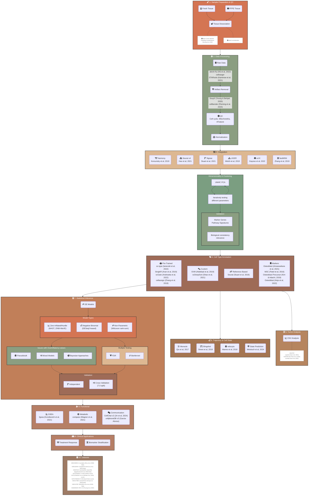

```mermaid
flowchart TB
subgraph SP["fa:fa-vial 1. Sample Preparation & QC"]
    direction TB
    fresh("fa:fa-flask Fresh Tissue")
    ffpe("fa:fa-box FFPE Tissue")
    dissoc("fa:fa-mortar-pestle Tissue Dissociation")
    note1["fa:fa-info-circle Bone Tumor Specific<br>Handling Considerations<br>Bruning et al, 2022"]
    note4["fa:fa-info-circle Batch consideration"]
end

subgraph DP["fa:fa-microchip 2. Data Processing"]
    direction TB
    raw("fa:fa-database Raw Data")
    artrem("fa:fa-filter Artifact Removal")
    qc("fa:fa-check-circle QC<br>Cell cycle, Mitochondria, nFeature")
    norm("fa:fa-balance-scale Normalization")
end

subgraph INT["fa:fa-object-group 3. Integration"]
    direction TB
    harm("fa:fa-project-diagram Harmony<br>Korsunsky et al, 2019")
    seurat("fa:fa-network-wired Seurat v4<br>Hao et al, 2021")
    signac("fa:fa-code-branch Signac<br>Stuart et al, 2021")
    liger("fa:fa-sitemap LIGER<br>Welch et al, 2019")
    scvi("fa:fa-brain scVI<br>Gayoso et al, 2022")
    fastmnn("fa:fa-compress-arrows-alt fastMNN<br>Zhang et al, 2019")
end

subgraph DIM["Dimensionality & Clustering"]
    
  direction TB
    red["UMAP, PCA"]
    clust["Iteratively testing <br> different parameters"]

    subgraph metrics["Validation"]
        
        bio1["Marker Genes <br> Pathway Signatures"]
        known["Biological consistency <Br> relevance"]  
    end


end

subgraph ANN["fa:fa-tags 4. Cell Type Annotation"]
    direction TB
    pre["fa:fa-robot Pre-Trained<br>sc-type (Ianevski et al, 2022)<br>SingleR (Aran et al, 2019)<br>scGate (Andreatta et al, 2022)<br>cellassign (Zhang et al, 2019)"]
    cust["fa:fa-cogs Custom<br>SVM (Abdelaal et al, 2019)<br>scDeepSort (Shao et al, 2021)"]
    ref["fa:fa-link Reference Based<br>Seurat (Stuart et al, 2019)"]
    mark["fa:fa-bookmark Markers<br>Osteoblast (Amarasekara et al, 2021)<br>MSC (Patel et al, 2016)<br>Osteoblast Precursor (Kim & Adachi, 2019)<br>Osteoblast (Hojo et al, 2022)"]
end

subgraph TUMOR["fa:fa-dna 5. Tumor Analysis"]
    direction TB
    cnv("fa:fa-chart-line CNV Analysis")
    note3["inferCNV<br>copyKat (Gao et al, 2021)<br>SCEVAN (De Falco et al, 2023)<br>numbat (Gao et al, 2022)"]
end

subgraph TRAJ["fa:fa-route 6. Trajectory & Cell State"]
    direction TB
    mono("fa:fa-stream Monocle<br>Qiu et al, 2017")
    sling("fa:fa-bezier-curve Slingshot<br>Street et al, 2018")
    velo("fa:fa-tachometer-alt velocyto<br>Manno et al, 2018")
    state("fa:fa-map-signs State Prediction<br>Weistuch et al, 2024")
end

subgraph STAT["fa:fa-calculator 7. Statistical Inference"]
    direction TB
    de("fa:fa-not-equal DE Models")
    
    subgraph models["Model Types"]
        direction TB
        zeroinf["fa:fa-chart-line Zero-Inflated/Hurdle<br>(MAST, ZINB-WaVE)"]
        negbin["fa:fa-square-root-alt Negative Binomial<br>(DESeq2-based)"]
        nonpar["fa:fa-not-equal Non-Parametric<br>(Wilcoxon rank-sum)"]
    end
    
    subgraph pseudo["Issues with Overinflated p-values"]
        direction TB
        pbulk["fa:fa-layer-group Pseudobulk"]
        mixed["fa:fa-random Mixed Models"]
        bayes["fa:fa-chart-pie Bayesian Approaches"]
    end
    
    subgraph mt["Multiple Testing"]
        direction TB
        fdr["fa:fa-filter FDR"]
        bonf["fa:fa-check-double Bonferroni"]
    end
    
    subgraph val["Validation"]
        direction TB
        indep["fa:fa-code-branch Independent"]
        cross["fa:fa-random Cross-Validation<br>(7:3 split)"]
    end

    de --> models
    models --> pseudo
    models --> mt
    pseudo --> val
    mt --> val
end

subgraph FUNC["fa:fa-puzzle-piece 8. Functional"]
    direction TB
    gsea("fa:fa-chart-bar GSEA<br>fgsea (Korotkevich et al, 2021)")
    meta("fa:fa-atom Metabolic<br>compass (Wagner et al, 2021)")
    comm("fa:fa-comments Communication<br>CellChat v2 (Jin et al, 2024)<br>cellphoneDB v3 (Garcia-Alonso)")
end

subgraph CLIN["fa:fa-hospital 9. Clinical Applications"]
    direction TB
    treat("fa:fa-heartbeat Treatment Response")
    bio("fa:fa-dna Biomarker Stratification")
end

subgraph DATA["fa:fa-database 10. Datasets"]
    note6["GSE152048: 11 samples (Zhou et al, 2020) fastq<br>GSE162454: 6 treatment-naïve (Liu et al, 2021) fastq<br>GSE87624: humans(49), mice(103), dogs(34) (Scott et al, 2018) fastq<br>SCPCP000017: N=28 (Collins) counts<br>SCPCP000018: N=11 (Shihabi et al, 2024) counts<br>SCPCP000023: N=52 (Dyer/Chen) counts<br>GSE147390: normal femur (Gong et al, 2020) fastq<br>GSE147287: BM-MSCs (Liu et al, 2023) fastq<br>GSE200529: PDX n=3 (Truong et al, 2024)"]
end

fresh --> dissoc
ffpe --> dissoc
dissoc -.- note1
dissoc -.- note4
raw -- "alevin-fry (He et al, 2022)<br>cellranger<br>STARsolo (Kaminow et al, 2021)" --> artrem
artrem -- "SoupX (Young & Behjati, 2020)<br>cellbender (Fleming et al, 2023)" --> qc
qc --> norm
cnv -.- note3

SP --> DP --> INT --> DIM --> ANN
ANN --> TUMOR & TRAJ & STAT
STAT --> FUNC --> CLIN --> DATA
red --> clust --> metrics
clust --> red
%% Style definitions
classDef note fill:#fff,stroke:#999,stroke-width:1px,color:#666,font-size:10px
note1:::note
note3:::note
note4:::note
note6:::note

style DIM fill:#7B9E81,stroke:#333,stroke-width:2px,color:#fff
style metrics fill:#8B9E81,stroke:#333,stroke-width:2px,color:#fff

style SP fill:#D47553,stroke:#333,stroke-width:2px,color:#fff
style DP fill:#8B9E81,stroke:#333,stroke-width:2px,color:#fff
style INT fill:#DDB892,stroke:#333,stroke-width:2px,color:#333
style ANN fill:#9E6B57,stroke:#333,stroke-width:2px,color:#fff
style TUMOR fill:#B6855F,stroke:#333,stroke-width:2px,color:#fff
style TRAJ fill:#A47551,stroke:#333,stroke-width:2px,color:#fff
style STAT fill:#C17F59,stroke:#333,stroke-width:2px,color:#fff
style models fill:#D47553,stroke:#333,stroke-width:2px,color:#fff
style pseudo fill:#8B9E81,stroke:#333,stroke-width:2px,color:#fff
style mt fill:#DDB892,stroke:#333,stroke-width:2px,color:#333
style val fill:#9E6B57,stroke:#333,stroke-width:2px,color:#fff
style FUNC fill:#B67F66,stroke:#333,stroke-width:2px,color:#fff
style CLIN fill:#B67F66,stroke:#333,stroke-width:2px,color:#fff
style DATA fill:#9E7B65,stroke:#333,stroke-width:2px,color:#fff
```
