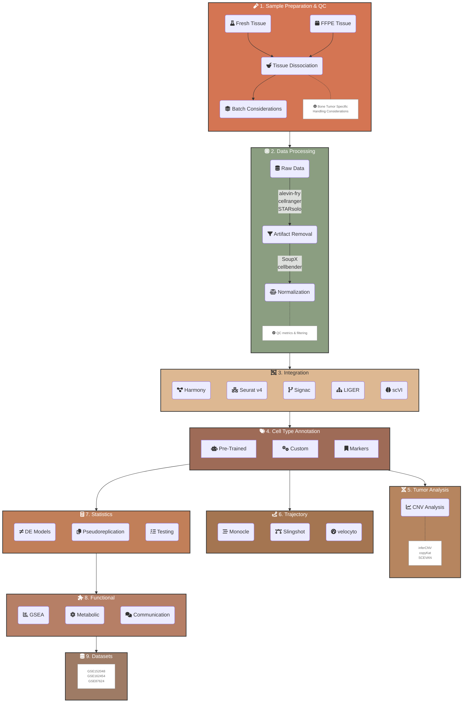

```mermaid
flowchart TB
%% Main workflow sections with icons
subgraph SP["fa:fa-vial 1. Sample Preparation & QC"]
    direction TB
    fresh("fa:fa-flask Fresh Tissue")
    ffpe("fa:fa-box FFPE Tissue")
    dissoc("fa:fa-mortar-pestle Tissue Dissociation")
    batch("fa:fa-layer-group Batch Considerations")
    
    fresh --> dissoc
    ffpe --> dissoc
    dissoc --> batch
    note1["fa:fa-info-circle Bone Tumor Specific<br>Handling Considerations"]
    dissoc -.- note1
end

subgraph DP["fa:fa-microchip 2. Data Processing"]
    direction TB
    raw("fa:fa-database Raw Data")
    artrem("fa:fa-filter Artifact Removal")
    norm("fa:fa-balance-scale Normalization")
    
    raw --> |"alevin-fry <br> cellranger<br>STARsolo"| artrem
    artrem --> |"SoupX<br>cellbender"| norm
    note2["fa:fa-check-circle QC metrics & filtering"]
    norm -.- note2
end

subgraph INT["fa:fa-object-group 3. Integration"]
    direction TB
    harm("fa:fa-project-diagram Harmony")
    seurat("fa:fa-network-wired Seurat v4")
    signac("fa:fa-code-branch Signac")
    liger("fa:fa-sitemap LIGER")
    scvi("fa:fa-brain scVI")
end

subgraph ANN["fa:fa-tags 4. Cell Type Annotation"]
    direction TB
    pre["fa:fa-robot Pre-Trained"]
    cust["fa:fa-cogs Custom"]
    mark["fa:fa-bookmark Markers"]
end

subgraph TUMOR["fa:fa-dna 5. Tumor Analysis"]
    direction TB
    cnv("fa:fa-chart-line CNV Analysis")
    note3["inferCNV<br>copyKat<br>SCEVAN"]
    cnv -.- note3
end

subgraph TRAJ["fa:fa-route 6. Trajectory"]
    direction TB
    mono("fa:fa-stream Monocle")
    sling("fa:fa-bezier-curve Slingshot")
    velo("fa:fa-tachometer-alt velocyto")
end

subgraph STAT["fa:fa-calculator 7. Statistics"]
    direction TB
    de("fa:fa-not-equal DE Models")
    pseudo("fa:fa-copy Pseudoreplication")
    mt("fa:fa-tasks Testing")
end

subgraph FUNC["fa:fa-puzzle-piece 8. Functional"]
    direction TB
    gsea("fa:fa-chart-bar GSEA")
    meta("fa:fa-atom Metabolic")
    comm("fa:fa-comments Communication")
end

subgraph DATA["fa:fa-database 9. Datasets"]
    note6["GSE152048<br>GSE162454<br>GSE87624"]
end

%% Main workflow connections
SP --> DP --> INT --> ANN
ANN --> TUMOR
ANN --> TRAJ
ANN --> STAT
STAT --> FUNC
FUNC --> DATA

%% Rustic color palette
style SP fill:#D47553,stroke:#333,stroke-width:2px,color:#fff
style DP fill:#8B9E81,stroke:#333,stroke-width:2px,color:#fff
style INT fill:#DDB892,stroke:#333,stroke-width:2px,color:#333
style ANN fill:#9E6B57,stroke:#333,stroke-width:2px,color:#fff
style TUMOR fill:#B6855F,stroke:#333,stroke-width:2px,color:#fff
style TRAJ fill:#A47551,stroke:#333,stroke-width:2px,color:#fff
style STAT fill:#C17F59,stroke:#333,stroke-width:2px,color:#fff
style FUNC fill:#B67F66,stroke:#333,stroke-width:2px,color:#fff
style DATA fill:#9E7B65,stroke:#333,stroke-width:2px,color:#fff

classDef note fill:#fff,stroke:#999,stroke-width:1px,color:#666,font-size:10px
class note1,note2,note3,note4,note5,note6 note
```
