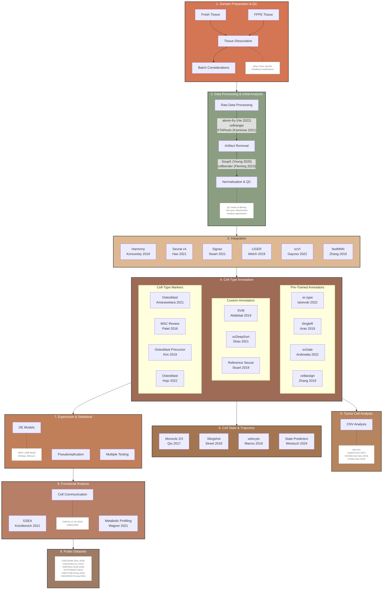

```mermaid
flowchart TB
    subgraph SP["1. Sample Preparation & QC"]
        direction TB
        fresh["Fresh Tissue"]
        ffpe["FFPE Tissue"]
        dissoc["Tissue Dissociation"]
        batch["Batch Considerations"]
        
        fresh & ffpe --> dissoc
        dissoc --> batch
        note1["Bone Tumor Specific<br/>Handling Considerations"]
        dissoc -.- note1
    end

    subgraph DP["2. Data Processing & Initial Analysis"]
        direction TB
        raw["Raw Data Processing"]
        artrem["Artifact Removal"]
        norm["Normalization & QC"]
        
        raw --> |"alevin-fry (He 2022)<br/>cellranger<br/>STARsolo (Kaminow 2021)"| artrem
        artrem --> |"SoupX (Young 2020)<br/>cellbender (Fleming 2023)"| norm
        note2["QC metrics & filtering<br/>Cell cycle, Mitochondria<br/>nFeature adjustments"]
        norm -.- note2
    end

    subgraph INT["3. Integration"]
        direction TB
        harm["Harmony<br/>Korsunsky 2019"]
        seurat["Seurat v4<br/>Hao 2021"]
        signac["Signac<br/>Stuart 2021"]
        liger["LIGER<br/>Welch 2019"]
        scvi["scVI<br/>Gayoso 2022"]
        fastmnn["fastMNN<br/>Zhang 2019"]
    end

    subgraph ANN["4. Cell Type Annotation"]
        direction TB
        subgraph pre["Pre-Trained Annotators"]
            sctype["sc-type<br/>Ianevski 2022"]
            singler["SingleR<br/>Aran 2019"]
            scgate["scGate<br/>Andreatta 2022"]
            cellassign["cellassign<br/>Zhang 2019"]
        end
        
        subgraph cust["Custom Annotators"]
            svm["SVM<br/>Abdelaal 2019"]
            scdeep["scDeepSort<br/>Shao 2021"]
            ref["Reference Seurat<br/>Stuart 2019"]
        end

        subgraph mark["Cell-Type Markers"]
            osteo["Osteoblast<br/>Amarasekara 2021"]
            msc["MSC Review<br/>Patel 2016"]
            prec["Osteoblast Precursor<br/>Kim 2019"]
            hojo["Osteoblast<br/>Hojo 2022"]
        end
    end

    subgraph TUMOR["5. Tumor Cell Analysis"]
        direction TB
        cnv["CNV Analysis"]
        note3["inferCNV<br/>copyKat (Gao 2021)<br/>SCEVAN (De Falco 2023)<br/>numbat (Gao 2022)"]
        cnv -.- note3
    end

    subgraph TRAJ["6. Cell State & Trajectory"]
        direction TB
        mono["Monocle 2/3<br/>Qiu 2017"]
        sling["Slingshot<br/>Street 2018"]
        velo["velocyto<br/>Manno 2018"]
        state["State Prediction<br/>Weistuch 2024"]
    end

    subgraph STAT["7. Expression & Statistical"]
        direction TB
        de["DE Models"]
        pseudo["Pseudoreplication"]
        mt["Multiple Testing"]
        note4["MAST, ZINB-WaVE<br/>DESeq2, Wilcoxon"]
        de -.- note4
    end

    subgraph FUNC["8. Functional Analysis"]
        direction TB
        gsea["GSEA<br/>Korotkevich 2021"]
        meta["Metabolic Profiling<br/>Wagner 2021"]
        comm["Cell Communication"]
        note5["CellChat v2 (Jin 2024)<br/>cellphoneDB"]
        comm -.- note5
    end

    subgraph DATA["9. Public Datasets"]
        note6["GSE152048 (Zhou 2020)<br/>GSE162454 (Liu 2021)<br/>GSE87624 (Scott 2018)<br/>SCPCP000017/18/23<br/>GSE147390 (Gong 2020)<br/>GSE200529 (Truong 2024)"]
    end

    SP --> DP --> INT --> ANN
    ANN --> TUMOR & TRAJ & STAT
    STAT --> FUNC
    FUNC --> DATA

    %% Rustic color palette
    style SP fill:#D47553,stroke:#333,stroke-width:2px,color:#fff
    style DP fill:#8B9E81,stroke:#333,stroke-width:2px,color:#fff
    style INT fill:#DDB892,stroke:#333,stroke-width:2px,color:#333
    style ANN fill:#9E6B57,stroke:#333,stroke-width:2px,color:#fff
    style TUMOR fill:#B6855F,stroke:#333,stroke-width:2px,color:#fff
    style TRAJ fill:#A47551,stroke:#333,stroke-width:2px,color:#fff
    style STAT fill:#C17F59,stroke:#333,stroke-width:2px,color:#fff
    style FUNC fill:#B67F66,stroke:#333,stroke-width:2px,color:#fff
    style DATA fill:#9E7B65,stroke:#333,stroke-width:2px,color:#fff

    classDef note fill:#fff,stroke:#999,stroke-width:1px,color:#666,font-size:10px
    class note1,note2,note3,note4,note5,note6 note
```
